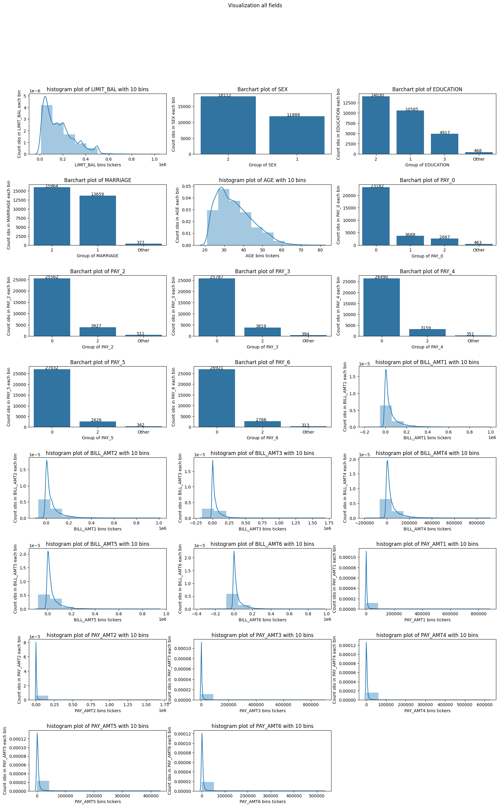
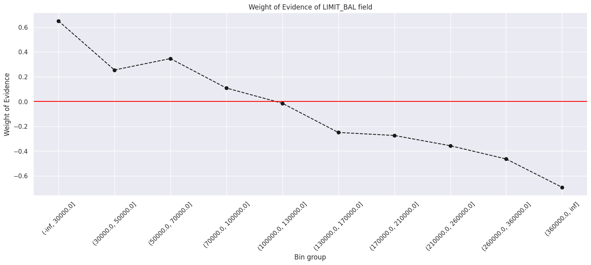
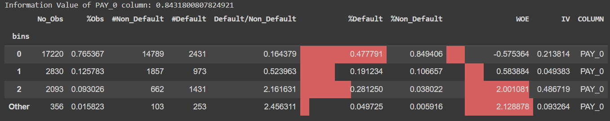
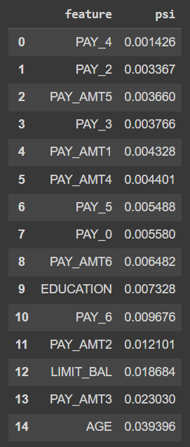
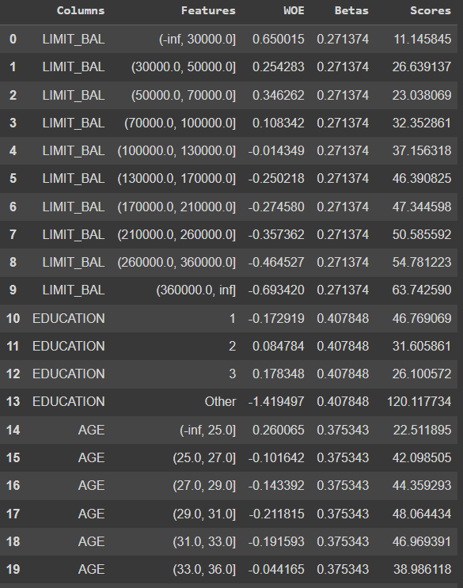
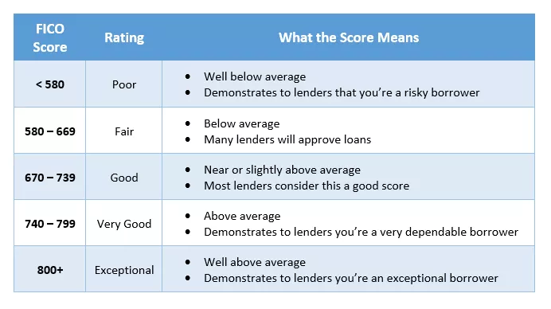

# Credit Scoring of Clients in Taiwan

## Table of content
1. [Introduction](#1)
2. [Data Overview](#2)
3. [Exploratory Data Analysis](#3)
    - [Target](#3.1)
    - [Category](#3.2)
4. [Feature Engineering](#4)
    - [Information value](#4.1)
    - [Feature Binning](#4.2)
    - [WoE Encoding](#4.3)
    - [Population Stability Index](#4.4)
5. [ML Models](#5)
6. [Scorecard Pipeline](#6)
    - [Distribution Analysis](#6.1)
    - [Threshold Tuning & Trade-off between loss & Coverage](#6.2)
7. [Conclusion & Future works](#7)

<a id="1"></a>
## Introduction
Mô hình xếp hạng tín dụng là bài toán rất nổi tiếng và có lịch sử lâu đời. Dựa theo hành trình tín dụng của KH từ lúc bắt đầu khởi tạo khoản vay tới lúc trả nợ , hành vi của khách hàng sẽ được chấm thông qua 3 loại điểm đánh giá tín dụng chính:

- Application Score (A score) : Điểm rủi ro tín dụng, ước lượng khả năng vỡ nợ (Đánh giá xem có cho vay hay ko, và nên cho vay hạn mức bao nhiêu)
- Behavior Score (B score) : Điểm hành vi tín dụng (Đánh giá hành vi tín dụng của người vay trong ngân hàng, thì nó có thể liên quan đến việc theo dõi và đánh giá hành vi thanh toán, lịch sử vay nợ và khả năng hoàn trả của người vay)
- Collection Score (C score) : Điểm khả năng thu hồi nợ (Đánh giá khả năng thu hồi nợ)

<a id="2"></a>
## Data Overview
Bộ dữ liệu này chứa thông tin về các khoản thanh toán mặc định, các yếu tố nhân khẩu học, dữ liệu tín dụng, lịch sử thanh toán và bảng sao kê hóa đơn của các khách hàng sử dụng thẻ tín dụng ở Đài Loan từ tháng 4 năm 2005 đến tháng 9 năm 2005.

Mục tiêu: Dự báo xác suất vỡ nợ của KH hay dự báo liệu KH có mất khả năng thanh toán trong kỳ hạn sắp tới (tháng tới) hay không?

Có tất cả 25 features:

- `ID`: ID của từng khách hàng
- `LIMIT_BAL`: Amount of given credit in NT dollars (includes individual and family/supplementary credit
- `SEX`: Giới tính (1=male, 2=female)
- `EDUCATION`: (1=graduate school, 2=university, 3=high school, 4=others, 5=unknown, 6=unknown)
- `MARRIAGE`: Tình trạng hôn nhân (1=married, 2=single, 3=others)
- `AGE`: Tuổi
- `PAY_0`: Tình trạng thanh toán tháng 9, 2005 (-1=thanh toán hợp lệ, 1=thanh toán chậm 1 tháng, 2=thanh toán chậm 2 tháng, ... 8=thanh toán chậm 8 tháng, 9=thanh toán chậm 9 tháng trở lên)
- `PAY_2`: Tình trạng thanh toán tháng 8, 2005 (thông tin như trên)
- `PAY_3`: Tình trạng thanh toán tháng 7, 2005 (thông tin như trên)
- `PAY_4`: Tình trạng thanh toán tháng 6 , 2005 (thông tin như trên)
- `PAY_5`: Tình trạng thanh toán tháng 5, 2005 (thông tin như trên)
- `PAY_6`: Tình trạng thanh toán tháng 4, 2005 (thông tin như trên)
- `BILL_AMT1`: Hoá đơn tháng 9, 2005 (NT dollar)
- `BILL_AMT2`: Hoá đơn tháng 8, 2005 (NT dollar)
- `BILL_AMT3`: Hoá đơn sao kê hoá đơn tháng 7, 2005 (NT dollar)
- `BILL_AMT4`: Hoá đơn sao kê hoá đơn tháng 6, 2005 (NT dollar)
- `BILL_AMT5`: Hoá đơn sao kê hoá đơn tháng 5, 2005 (NT dollar)
- `BILL_AMT6`: Hoá đơn sao kê hoá đơn tháng 4, 2005 (NT dollar)
- `PAY_AMT1`: Số tiền thanh toán trước đó vào tháng 9, 2005 (NT dollar)
- `PAY_AMT2`: Số tiền thanh toán trước đó vào tháng 8, 2005 (NT dollar)
- `PAY_AMT3`: Số tiền thanh toán trước đó vào tháng 7, 2005 (NT dollar)
- `PAY_AMT4`: Số tiền thanh toán trước đó vào tháng 6, 2005 (NT dollar)
- `PAY_AMT5`: Số tiền thanh toán trước đó vào tháng 5, 2005 (NT dollar)
- `PAY_AMT6`: Số tiền thanh toán trước đó vào tháng 4, 2005 (NT dollar)
- `default.payment.next.month`: Default payment (1=yes, 0=no) (Biến mục tiêu)

*Dựa theo phân loại trên và dữ liệu được sử dụng, đây là bài toán đánh giá **Behavior Score** của khách hàng*

<a id="3"></a>
## Exploratory Data Analysis

<a id="3.1"></a>
### Target


Có thể thấy số lượng khách hàng không thể thực hiện các thanh toán trong tháng tới lớn hơn rất nhiều so với những khách hàng thực hiện thanh toán (78% - 22%). Có thể thấy dữ liệu này **không cân bằng**

<a id="3.2"></a>
### Category

Bộ dữ liệu này không có missing values và không có biến categorical nhưng thực tế có ba biến categorical đã được encoding `SEX`, `EDUCATION`, `MARRIAGE`, `PAY_X (X = 0, 2, 3, 4, 5, 6)`

- SEX: Giới tính (1=male, 2=female)
- EDUCATION: (1=graduate school, 2=university, 3=high school, 4=others, 5=unknown, 6=unknown)
- MARRIAGE: Tình trạng hôn nhân (1=married, 2=single, 3=others)
- PAY_X (X = 0, 2, 3, 4, 5, 6): Tình trạng thanh toán tháng (9, 8, 7, 6, 5, 4) năm 2005

Sau khi làm sạch dữ liệu (chỉnh các dữ liệu nhâp lỗi, gom các dữ liệu categorical có số quan sát dưới 5% thành `Other`). Dữ liệu thu được dưới đây



<a id="4"></a>
## Feature Engineering

<a id="4.1"></a>
### Information value 

Sau khi làm sạch dữ liệu và EDA, chúng ta sẽ chia dự liệu theo tỉ lệ **75% - 25%**. Dữ liệu được chia dựa theo chuỗi thời gian dựa theo cột ID.

Tiếp theo tính **Information Value (IV)** của từng biến trong tập train. IV dùng để đo độ tương quan giữa biến độc lập và biến dự đoán (ở dạng binary)


Trong thực tế, các biến có IV nhỏ hơn 0.02 sẽ bị loại. Từ đó, 2 biến `SEX`, `MARRIAGE`, `BILL_AMT(1,2,3,4,5,6)` sẽ bị loại. Có thể thấy `PAY_0` có IV cao nhất. Điều này hợp lí vì biến thể hiện tình trạng thanh toán ở thời điểm gần với thời điểm cần dự đoán nhất

<a id="4.2"></a>
### Feature Binning

Sử dụng **Percentile binning** và đảm bảo tỷ lệ mẫu tối thiểu (thông thường là **trên 5% và có dưới 70%**). Tuy nhiên quá trình chia các nhóm biến phù hợp cần phải tinh chỉnh nhiều lần để ra được kết quả phù hợp. Sau đây là quá trình thực hiện:

- Tự động phân biến thành n nhóm ban đầu theo percentile (thường là băm 20 nhóm, theo phân vị 5% quan sát)
- Dựa trên các nhóm giá trị đã được phân khoảng ở bước 1, nếu nhóm có tỷ lệ mẫu nhỏ hơn tỷ lệ mẫu tối thiểu quy định thì gộp với nhóm liền kề cho đến khi không còn nhóm nào không thỏa mãn tỷ lệ mẫu tối thiểu quy định
- Dựa trên các nhóm giá trị thu được ở bước 2, tự động gộp các nhóm liền kề có tỷ lệ vỡ nợ tương tự vào với nhau, trong đó đảm bảo số lượng nhóm cuối cùng >=2

Các tiêu chí đánh giá các biến sau khi binning:
- Tính trực quan – điều chỉnh giới hạn của mỗi nhóm thành số làm tròn.
- Tính đơn điệu – đảm bảo rằng xu hướng của xác suất vỡ nợ tăng dần hoặc giảm dần một cách càng rõ ràng càng tốt, đồng thời thể hiện một xu hướng phù hợp với ý nghĩa kinh doanh thông thường. Trường hợp biến số sau khi nhóm không có xu hướng đơn điệu tăng/giảm sẽ xem xét loại (Loại biến Ushape giữ các biến dạng Monotonic).
- Tỷ lệ mẫu tối thiểu– gộp các nhóm giá trị có số lượng mẫu quá ít không thỏa mãn tỷ lệ mẫu tối thiểu quy định (thông thường là trên 5% và có dưới 70% -tùy trường hợp điều chỉnh)
- Ý nghĩa kinh doanh – gộp và phân chia các nhóm phù hợp với ý nghĩa kinh doanh, chính sách sản phẩm, phụ thuộc rất nhiều vào ý kiến xác nhận của chuyên gia Ngân hàng đã có nhiều năm kinh nghiệm trong thẩm định khách hàng, phê duyệt tín dụng, chính sách sản phẩm,...

Dưới đây là đồ thị để kiểm tra từng nhóm biến (Ví dụ cho `LIMIT_BAL`, các biến khác cũng tương tự)


Đồ thị WoE qua các nhóm bin



Với biến categorical `PAY_0`



Nhận xét: 
- Qua biểu đồ cột có thể thấy các bin đều **thỏa mãn yêu cầu sô lượng quan sát mỗi bin phải trong khoảng 5 - 70%**
- Qua biểu đồ đường có thể thấy đảm bảo rằng **xu hướng của xác suất vỡ nợ có xu hướng giảm dần một cách càng rõ ràng**. Trong thực tế, biến số sau khi nhóm không có xu hướng đơn điệu tăng/giảm sẽ xem xét loại.

<a id="4.3"></a>
### WoE Encoding

WoE là thước đo phản ánh độ lớn của tỷ lệ khách hàng tốt/khách hàng xấu trong mỗi nhóm của một biến hay khả năng phân biệt khách hàng tốt/khách hàng xấu của mỗi nhóm.


<a id="4.4"></a>
### Population Stability Index

Việc tính PSI của các biến độc lập trong tập train và test để chắc chắn rằng không có sự dịch chuyển phân phối của các biến. Các biến của PSI > 0.25 sẽ bị loại.



<a id="5"></a>
## ML Models

Với dữ liệu thu được sau xử lí, chúng ta sẽ sử dụng các model ML để so sánh hiệu suất dự đoán

| Model  | AUC   | Type II (%)  |  
|:---:|:---:|:---:|
| Logistic Regression + WoE | 0.7805 | 9.27 |   
| Random Forest  | 0.7729  | 11.79  |   
| AdaBoost   |  0.7753 |  **8.23** |   
| CatBoost   | 0.7696  | 13.41  |   
| LightGBM   |  **0.7871** | 13.29  |   
| XGBoost   |  0.7643 | 13.48  | 

- Với bài toán Behavior Scoring, chúng ta nên chú trọng vào việc **giảm số lượng sai lầm loại II (FN)** mà mô hình phán đoán được. Những khách hàng thuộc sai lầm loại II về thực tế họ đã chưa thanh toán nhưng mô hình dự đoán những khách hàng này đã thanh toán theo đúng kỳ hạn. Xét theo góc độ tín dụng, nếu KH trả lãi không đủ và đúng hạn thì điểm tín dụng của KH sẽ thấp, nhảy nhóm nợ trên hệ thống tin tín dụng quốc gia CIC, điều này sẽ gây khó khăn cho các khoản vay tiếp theo của KH vì để có một CIC đẹp là người đã từng vay và trả lãi đúng hạn nên sai lầm loại II (FN) có tính chất nghiêm trọng hơn. Do đó, ngoài việc lựa chọn mô hình tốt, chúng ta cũng cần lựa chọn những mô hình có các TH thuộc sai lầm loại II là thấp nhất.
- Dựa vào đồ thị trên kết hợp với confusion matrix của các mô hình đã huấn luyện ở trên thì mô hình LightGBM cho **AUC tốt nhất 78.03%** và mô hình AdaBoost có **số lượng sai lầm loại II thấp nhất 8.28%**. Ở đây chúng ta sẽ thấy mô hình **Logistic Regression** có AUC và Type II gần như không kém 2 mô hình trên quá nhiều mà có rất nhiều ưu điểm như mô hình rất dễ giải thích và đơn giản để có thể huấn luyện, kiểm thử, tinh chỉnh trong thời gian ngắn, do đó chọn mô hình **Logistic Regression** làm mô hình cuối cùng để áp dụng vào bài toán này!

<a id="6"></a>
## Scorecard Pipeline

Sau khi đã chọn được mô hình, bước tiếp là tạo pipeline để lấy được bảng tiêu chí chấm điểm tín dụng cho từng khách hàng.



Có thể xem toàn bộ tiêu chí [tại đây](./docs/CreditScore_save6_score_card_df.csv)

<a id="6.1"></a>
### Distribution Analysis


Đỉnh của phân phối của `Good customer` sẽ có xu hướng dịch về phải và `Default customer` sẽ dịch về trái. 2 phân phối này càng có sự phân cực rõ ràng thì scorecard phân hóa khách hàng càng hiệu quả.

<a id="6.2"></a>
### Threshold Tuning & Trade-off between loss & Coverage

Việc chọn ngưỡng để phân khách hàng vào các nhóm sẽ được các chuyên gia quyết định, trong đó có chỉ số của **FICO score** rất phổ biến



Để thấy rõ hơn, tiến hành chia các khách hàng thành 8 nhóm khác nhau tương đương với **8 khoảng điểm tín dụng khác nhau, từ Blacklist đến Perfect Credt.**


Từ đây chúng ta sẽ tinh chỉnh từng khoảng điểm tín dụng cho phù hợp nhất với mỗi nhóm và nhận được **bảng Loss & Coverage** cho từng bậc

```
Level 8: Loss is  0.05405405405405406 ; Coverage is  0.11758777087182933
Level 7-Level 8: Loss is  0.06246450880181715 ; Coverage is  0.2773391567277003
Level 6-Level 8: Loss is  0.08287866978435958 ; Coverage is  0.5929783302536537
Level 5-Level 8: Loss is  0.11315933564519073 ; Coverage is  0.8162271123803124
Level 4-Level 8: Loss is  0.1279947489333771 ; Coverage is  0.8926591634470015
Level 3-Level 8: Loss is  0.1480927449513837 ; Coverage is  0.9566605073072401
Level 2-Level 8: Loss is  0.17300891215164804 ; Coverage is  0.9820258693095918
Level 1-Level 8: Loss is  0.18430176119816946 ; Coverage is  0.9880732403830002
Level 0-Level 8: Loss is  0.20637248366884414 ; Coverage is  1.0
```


```
Total customer: 7501
Total default customer: 1548
```

Từ bảng tổng kết trên có thể thấy:

- Nếu cho toàn bộ khách hàng vay tiền (từ bậc 0 đến 8) thì tỷ lệ sai sót là **tổng khách hàng vợ nợ / tổng khách hàng (1548/7501) ~ 21%**
- Giả sử sếp yêu cầu có thể cho **tối đa 75% khách hàng nộp hồ sơ được vay tiền và chấp nhận một chút rủi ro là khoảng 10%** thì nên cho các **khách hàng từ bậc 6 trở lên** do tỷ lệ sai sót là (40 + 70 + 209 + 301)/(1630 + 2088 + 1021 + 740) = 11.01% với số lượng khách hàng được vay là (1630 + 2088 + 1021 + 740)/ (tổng khách hàng nộp hồ sơ) là 73.04%

<a id="7"></a>
## Conclusion & Future works

Khai thác thêm nhiều biến để cải thiện hiệu suất dự đoán và giúp tăng false positive rate để khách hàng hài lòng hơn


